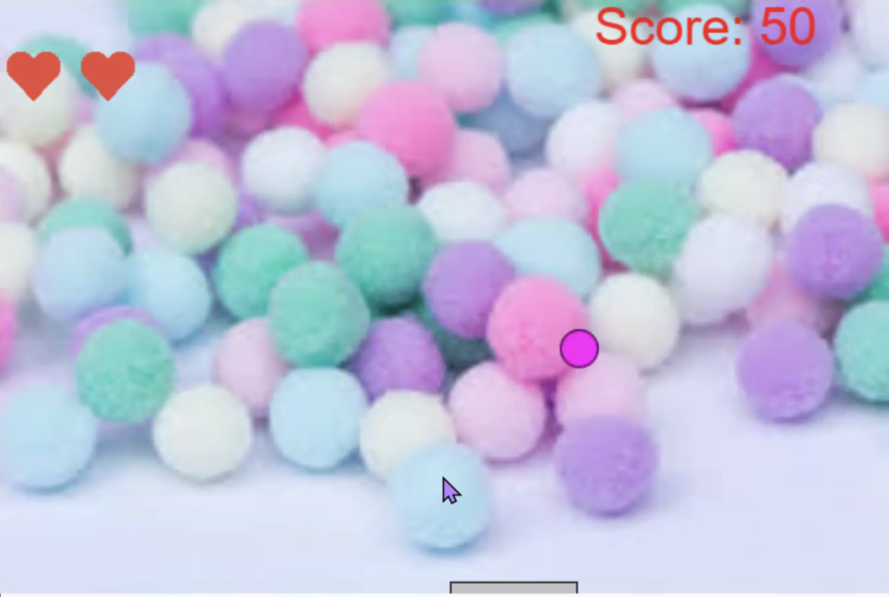
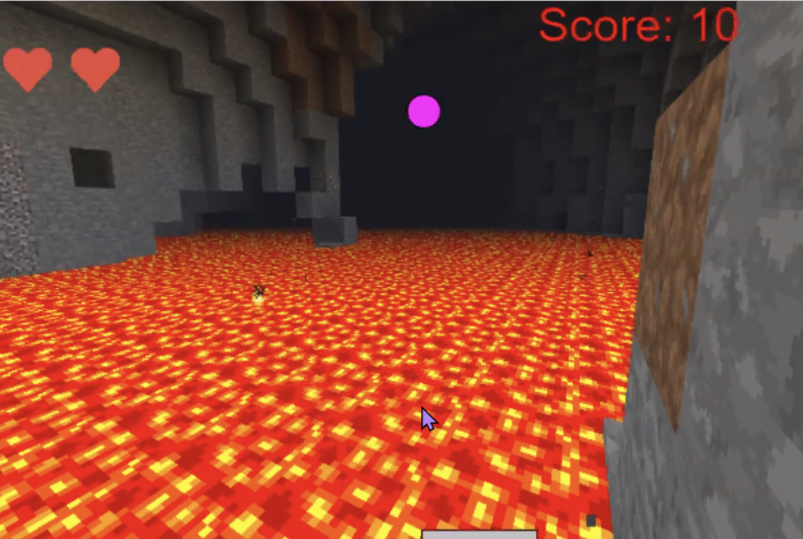
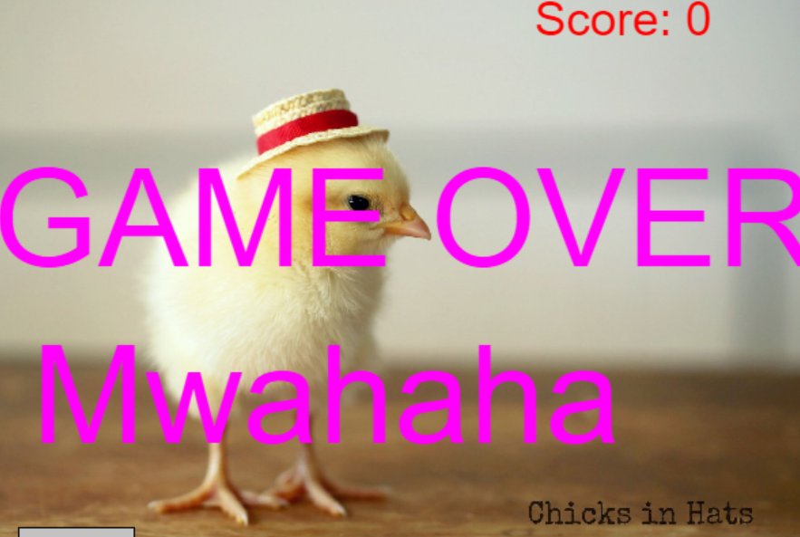

# Addicting-Game
Game created in Python.

## Description
The goal of this game is keep the ball from going of the screen.
Every the ball hits the paddle you get ten points.

## Screenshots

## How to Play
To control the paddle, move your mouse horizontally.
You start with three lives.
If you miss the ball, you lose a life.
You get points everytime the ball touches the paddle.
Challenge your friends.

## Choose Your Backround
To change your backround press b.
Then press p to play.

